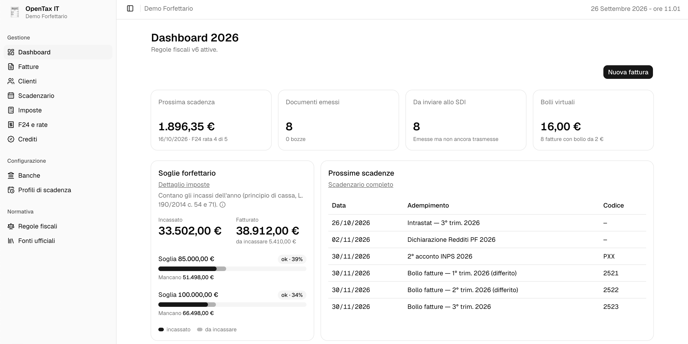

# OpenTax IT

Gestionale **open source** (`opentax-it`) per partite IVA italiane in **regime forfettario** (L. 190/2014, art. 1 c. 54-89):

- fatture e note di credito in formato **FatturaPA** (XML); invio allo **SDI via PEC** (nessun provider a pagamento, nessun accreditamento) *in sviluppo*;
- **principio di cassa**: emesso vs incassato, reddito imponibile calcolato sugli incassi dell'anno;
- **soglie 85.000 / 100.000 €** con avviso di avvicinamento, proiezione sulle fatture da incassare e limite personale che chiede conferma prima di emettere;
- **clienti italiani, UE ed extra UE**, aziende o privati, con natura IVA e diciture corrette (art. 7-ter e 7-septies DPR 633/72); fatture in **valuta** con il cambio di riferimento della Banca d'Italia;
- **scadenzario**: saldo, acconti (40/60, o 50/50 per i soggetti ISA), rate mensili fino al 16 dicembre, INPS Gestione Separata, imposta di bollo trimestrale;
- **libro mastro crediti/compensazioni** (credito da dichiarazione → F24 che lo usano → residuo);
- preparazione F24 per rata, stampati sul modello ufficiale AdE e pensati per l'addebito a date future (**I24**) da inviare con F24 web;
- registro degli **avvisi/comunicazioni** (CIVIS) e delle relative rate *(da fare)*;
- **regole fiscali versionate per anno** (`FiscalRuleSet`): niente valori hardcodati; ogni nuovo set va attivato esplicitamente dall'amministratore; un job che controlla periodicamente le fonti ufficiali (AdE, INPS, GU/Normattiva, ADM) e propone le modifiche è *da fare*;
- schema **multi-tenant** fin dall'inizio.



> **Avvertenza.** Questo software è uno strumento di supporto al calcolo e all'organizzazione: **non è consulenza fiscale** e non sostituisce un professionista abilitato. **Non si garantisce la veridicità né la correttezza dei dati e dei calcoli prodotti: la responsabilità del loro uso è esclusivamente dell'utilizzatore.** Le regole fiscali cambiano ogni anno; verifica sempre i valori attivi con le fonti ufficiali. Gli autori e i contributori non rispondono di errori di calcolo, sanzioni o omissioni derivanti dall'uso del software: vedi [DISCLAIMER.md](DISCLAIMER.md) e [LICENSE](LICENSE), sez. 15-16.

> **Conservazione a norma.** Chi emette e chi riceve una fattura elettronica è obbligato a conservarla a norma (DPR 633/72 art. 39). Salvare i file sul computer non basta: OpenTax IT archivia l'XML ma **non** è un sistema di conservazione. Finché non lo sarà, aderisci al servizio gratuito dell'Agenzia delle Entrate dal portale "Fatture e Corrispettivi" (sezione "Fatturazione elettronica e Conservazione"): conserva per 15 anni tutte le fatture emesse e ricevute tramite SDI. Fonte: [AdE, "Come si conservano le fatture elettroniche"](https://www.agenziaentrate.gov.it/portale/aree-tematiche/fatturazione-elettronica/guida-fatturazione-elettronica/come-predisporre-inviare-ricevere-fe/come-si-conservano-fe).

## Stato

Fase iniziale, in uso **solo in locale** (manca ancora l'autenticazione). Ogni funzione è ancorata a una fonte ufficiale, elencata in [docs/compliance.md](docs/compliance.md); le citazioni verificate sono in [docs/normativa-2026.md](docs/normativa-2026.md).

**Funziona**
- **Regole fiscali** (`/rules`): set 2025 e 2026 (`packages/fiscal-rules`), consultabili per sezione, ogni valore con la sua fonte e la citazione esatta; versioni per anno, attivazione manuale e, prima di attivare una bozza, cosa cambia rispetto al set attivo.
- **Fonti ufficiali** (`/sources`): registro dei documenti letti con la copia archiviata ([docs/fonti](docs/fonti/README.md)); per ogni fonte le regole che la citano, con la citazione evidenziata nel testo. I test verificano che ogni citazione compaia nel documento archiviato.
- **Fatture** (`/invoices`): clienti, bozze illimitate e modificabili, note di credito, emissione con numerazione progressiva e XML FatturaPA validato sullo schema ufficiale, copia di cortesia in PDF, import di XML emessi con altri software. Data mai nel futuro (errore SDI 00403), clienti esteri azienda o privato, valuta con cambio precompilato dalla Banca d'Italia.
- **Incassi e soglie**: principio di cassa, incasso registrato dall'elenco fatture (anche parziale), modalità di pagamento scelta sulla fattura, incassi in valuta al cambio del giorno, soglie 85.000 / 100.000 € in dashboard e all'emissione, limite personale nel profilo.
- **Imposte** (`/taxes`): reddito, imposta sostitutiva, contributo INPS Gestione Separata (in euro interi sul rigo LM34), acconti 40/60 o 50/50 ISA; sopra 100.000 € il calcolo forfettario si ferma.
- **F24** (`/f24`, `/credits`): piano rate con interessi, differimento con maggiorazione (per l'INPS nella riga DPPI), compensazione dei crediti a saldo zero, stampa sul modello ufficiale AdE, stato delle deleghe e date I24.
- **Scadenzario** (`/deadlines`) e **dashboard** (`/dashboard`), con festività nazionali calcolate per ogni anno.

**Limiti noti** (dettagli in [TODO.md](TODO.md))
- L'invio allo SDI via PEC e la lettura delle ricevute non ci sono ancora: l'XML va trasmesso con un altro canale.
- Nessuna conservazione a norma: vedi l'avviso sopra.
- Fatture verso la **PA** bloccate: serve la firma qualificata, non ancora supportata.
- Servizi elettronici a privati UE (art. 7-octies, OSS) e bollo nelle fatture in valuta: da verificare.

**Cosa manca**, per epiche: [TODO.md](TODO.md) (in testa: conformità, sicurezza di base, autenticazione e invio PEC allo SDI). Regola per chi contribuisce: solo fonti ufficiali verificate, nessuna assunzione ([CONTRIBUTING.md](CONTRIBUTING.md)). Il design del monitoraggio normativo è in [docs/monitoraggio-normativo.md](docs/monitoraggio-normativo.md).

## Struttura

```
apps/api       NestJS + Prisma (PostgreSQL)
apps/web       Next.js + shadcn/ui
packages/fiscal-rules   regole fiscali pure (TypeScript), testate, con riferimento normativo
packages/fatturapa      generatore XML FatturaPA validato contro l'XSD ufficiale
docs/          normativa, design
```

## Avvio rapido

Requisiti: Node 24 (vedi `.nvmrc`), pnpm 10, Docker.

```bash
pnpm install
cp .env.example .env   # poi scegli POSTGRES_PASSWORD e riportala in DATABASE_URL
pnpm db:up          # PostgreSQL in Docker
pnpm db:migrate     # schema Prisma
pnpm dev            # api (http://localhost:3000/api) + web (http://localhost:3001)
```

> **Solo uso locale.** L'autenticazione non c'è ancora ([TODO.md](TODO.md)): chi raggiunge l'API può leggere e modificare i dati di qualunque partita IVA. Per questo API, web e database ascoltano solo su `127.0.0.1` e rifiutano le richieste con un host diverso da quelli in `ALLOWED_HOSTS` (protezione contro il DNS rebinding). Non esporli in rete, nemmeno su un NAS, finché l'autenticazione non è pronta.

Dopo ogni `git pull`:

```bash
pnpm install        # nuove dipendenze
pnpm db:migrate     # nuove migrazioni del database
pnpm dev            # rigenera il client Prisma e riavvia api e web
```

Se l'aggiornamento porta nuovi set di regole, in **Regole fiscali** (`/rules`) caricali, controlla cosa cambia e attivali.

Al primo avvio apri http://localhost:3001/setup/new e crea la partita IVA (profilo fiscale). Poi in **Regole fiscali** (`/rules`) carica i set forniti con l'applicazione e attiva quello di ogni anno; conti bancari e profili di scadenza si aggiungono nelle pagine **Banche** (`/banks`) e **Profili di scadenza** (`/payment-terms`). Lo stesso vale ogni volta che un aggiornamento del codice porta un nuovo set: viene proposto come nuova versione in bozza, con il confronto rispetto al set attivo, e non è mai attivato automaticamente.

Per vedere il flusso con dati inventati: `pnpm demo:seed` (con `pnpm dev` attivo) crea la partita IVA "Demo Forfettario" con clienti, fatture e incassi dell'anno scorso e di quest'anno, due crediti e il piano rate F24; selezionala in `/setup` e apri `/taxes` e `/f24`. `pnpm demo:seed --reset` la cancella e la ricrea con le regole attive. Il seed carica prima i set di regole forniti con il codice e si ferma se c'è una bozza più recente di quella attiva: non attiva mai nulla da solo.

## Contribuire

Leggi [CONTRIBUTING.md](CONTRIBUTING.md): si lavora solo su fonti ufficiali verificate, nessuna assunzione. Ogni regola fiscale deve citare la fonte ufficiale (norma, provvedimento, circolare) nel codice e nei test.

## Cosa manca

La lista dei lavori aperti, per epiche e con le fonti da cui partire, è in [TODO.md](TODO.md). I punti verificabili ma ancora senza fonte sono in [docs/compliance.md](docs/compliance.md), sezione "Non verificato / aperto".

## Licenza

[AGPL-3.0-only](LICENSE). Se modifichi il software e lo offri come servizio in rete, devi rendere disponibile il codice sorgente modificato agli utenti del servizio.
